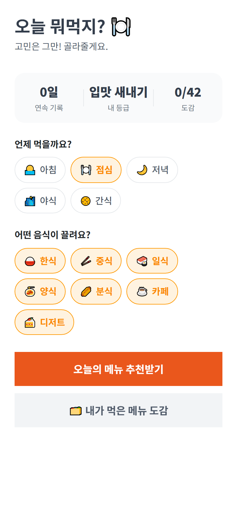
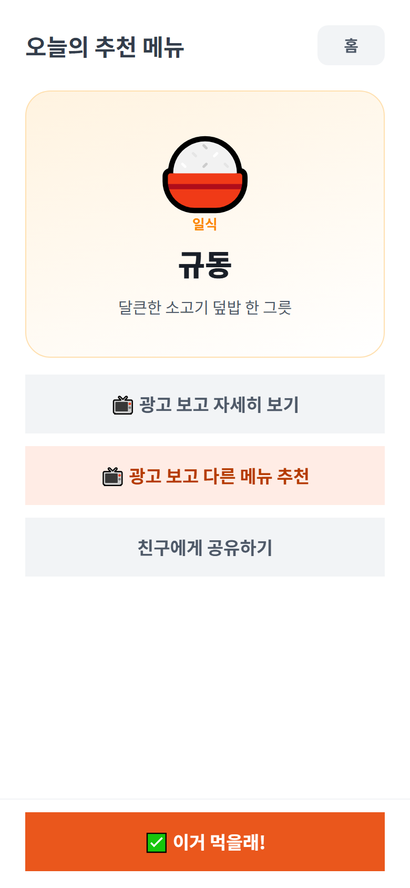
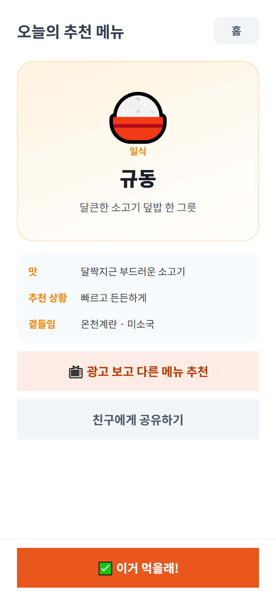
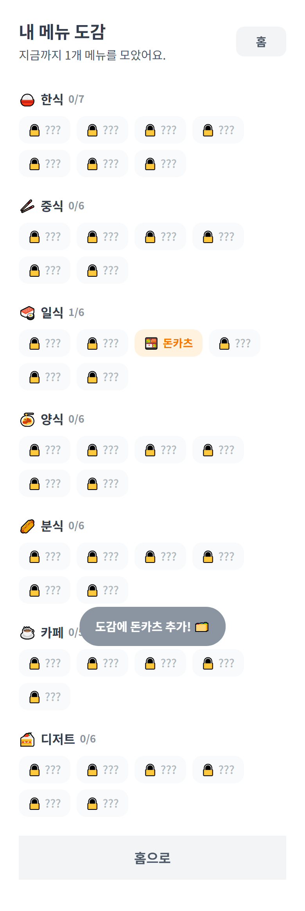
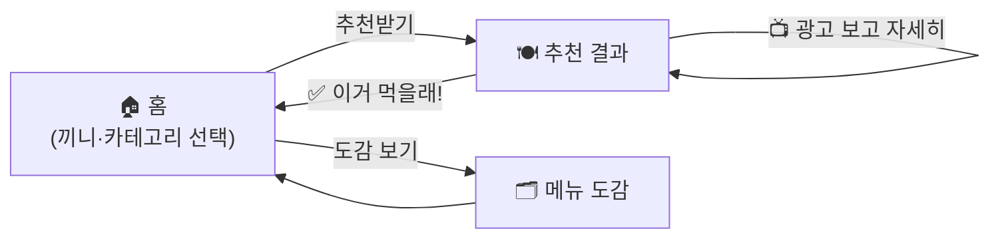

<div align="center">

# 🍽️ 오늘 뭐먹지 (What to Eat)

**끼니·약속마다 "오늘 뭐 먹지?" 고민을 대신 정해주는 메뉴 추천 + 먹은 메뉴 도감 미니앱**

[](https://react.dev)
[](https://www.typescriptlang.org)
[](https://vitejs.dev)
[](https://apps-in-toss.toss.im)

토스 앱 속에서 동작하는 WebView 미니앱이에요. 서버·로그인 없이 **클라이언트만으로** 동작해요.

</div>

---

## 📑 목차
- [한눈에 보기](#-한눈에-보기) · [스크린샷](#-스크린샷) · [핵심 기능](#-핵심-기능) · [기술 스택](#-기술-스택)
- [설계](#-설계) · [엔지니어링 하이라이트](#-엔지니어링-하이라이트) · [로컬 실행](#-로컬-실행) · [구조](#-프로젝트-구조) · [로드맵](#-로드맵)

---

## 🎯 한눈에 보기

> 조건 선택 → 메뉴 추천 → "다른 메뉴 더 보기"(보상형 광고) → "이거 먹을래!" 기록 → 도감·연속 기록·등급 상승 → 다음 끼니에 재방문

| | |
|---|---|
| **무엇을** | 끼니/음식 종류를 고르면 메뉴를 추천해주고, 먹은 메뉴를 도감에 모으는 결정 도우미 |
| **어디서** | 토스 앱 내 미니앱 (3,000만 토스 유저 노출) |
| **누구를 위해** | "메뉴 정하기"가 매번 귀찮은 모두 — 하루에도 여러 번 켜는 짧은 세션 |
| **누가** | 1인 기획·개발 (프론트엔드 + 게이미피케이션 경제 설계 + 광고/심사 운영 정책) |

---

## 📸 스크린샷

| 홈 | 추천 결과 | 상세(해금) | 메뉴 도감 |
|:---:|:---:|:---:|:---:|
|  |  |  |  |

---

## ✨ 핵심 기능
- **메뉴 추천 (비게임 코어)** — 끼니·카테고리를 고르면 맞는 메뉴를 추천. "다른 메뉴 더 보기"로 마음에 들 때까지.
- **먹은 메뉴 도감** — 한식부터 디저트까지 7개 카테고리에 차곡차곡 수집(순서형, 무작위 뽑기 아님).
- **연속 기록 · 미식가 등급** — 매일 기록을 이어가면 연속일과 등급(입맛 새내기 → 미식 마스터)이 올라가요.
- **선택형 광고 게이트** — "다른 메뉴 더 보기 / 자세히 보기"를 보상형 광고로 해금. 강제 광고벽 없음, 보상은 **결정적**(+1·상세 해금).
- **그레이스풀 디그레이데이션** — 광고 키가 없어도 브라우저에서 흐름이 끊기지 않아요.

> 모든 보상은 앱 내 가상 보상이에요. (현금/포인트 없음)

---

## 🛠 기술 스택

| 영역 | 사용 기술 |
|---|---|
| **언어** | TypeScript 5.7 (strict) |
| **프론트엔드** | React 18, Vite 6, Emotion |
| **디자인 시스템** | TDS Mobile (토스 디자인 시스템) |
| **플랫폼 SDK** | `@apps-in-toss/web-framework` (Granite 런타임 · WebView 브릿지 · 인앱광고 · 공유 · 서버시각) |
| **상태/저장** | React 상태 + `localStorage` (서버·DB 없음) |
| **수익화** | 인앱 광고(보상형·전면·배너) — 게이미피케이션 기반 자발적 노출 |
| **품질** | ESLint(flat config), Prettier, Playwright(전 화면 스크린샷 스모크) |
| **배포** | `ait build` → `.ait` 아티팩트 → `ait deploy` |

---

## 🧭 설계

서버가 없는 **클라이언트 상태 머신**이에요. 화면은 `home → result → collection` 세 상태로 전환되고, 도감·연속 기록·누적 기록은 `localStorage`에 저장돼요. 네이티브 뒤로가기(`backEvent`)는 홈이 아니면 홈으로, 홈이면 앱을 닫도록 연결했어요.



**설계 의도**
- 광고는 **선택형 게이트**로 — 우유부단할 때 "다른 메뉴 더 보기"가 자연스러운 자발적 시청 지점이 돼요. (강제 광고벽 없음)
- 광고 보상은 **결정적**(추천 +1 / 상세 해금) — 확률↑·리롤·랜덤 상자 없음(사행성 표면 0).
- 연속 기록 판정은 **서버 시각(KST)** 기준(`getServerTime`) — 클라 시계를 신뢰하지 않아요.

---

## 💡 엔지니어링 하이라이트

<details open>
<summary><b>1. 강제하지 않고 자발적으로 보게 만든 광고 루프</b></summary>

> "추천이 마음에 안 들 때 한 번 더 보고 싶다"는 욕구 지점에 보상형 광고를 배치했어요. 첫 추천은 무료(그레이스풀), 추가 추천만 옵트인 광고. 보상은 현금이 아니라 도감·연속 기록·등급이라 사행성 표면이 0이고, 광고 매출이 안정되면 토스포인트로 전환할 지점만 비워뒀어요.
</details>

<details>
<summary><b>2. 서버 없이 무너지지 않는 일일 리셋</b></summary>

> 연속 기록은 클라 시계 대신 `getServerTime()`(KST 보정)으로 날짜 키를 만들어 판정해요. 서버 시각을 못 받으면 기기 시각으로 자연 폴백해 오프라인/브라우저에서도 끊기지 않아요.
</details>

<details>
<summary><b>3. 그레이스풀 디그레이데이션</b></summary>

> 광고는 `isSupported()` 가드 + 빈 ad-group id 즉시 통과로 처리했어요. 광고 키가 없는 브라우저 개발 환경에서도 "광고 보고 다른 메뉴"가 그대로 다음 추천을 보여줘서, Playwright로 전 화면을 끊김 없이 캡처할 수 있어요.
</details>

<details>
<summary><b>4. 심사 안전성을 코드·카피에 내장</b></summary>

> 비게임 코어(추천+기록), 익명/로컬(개인정보 수집 0 → 회원탈퇴 엔드포인트 불필요), 금칙어 0("룰렛/뽑기" 대신 "추천"), 배너 화면당 1개, 전면 세션당 ≤1 — 토스 심사 가이드를 설계 단계에서 통과하도록 맞췄어요.
</details>

---

## 🚀 로컬 실행

```bash
npm install
cp .env.example .env   # 값은 비워둬도 '둘러보기'로 흐름 확인 가능
npm run dev            # http://localhost:5173
```
```bash
npm run build          # vite/ait 빌드 → .ait 아티팩트
npm run deploy         # 앱인토스 콘솔로 배포
node scripts/screenshots.mjs   # 전 화면 스크린샷(dev 서버 실행 중)
```

---

## 📂 프로젝트 구조

```
src/
├─ lib/         env · analytics · tossEnv · serverTime(KST) · storage(localStorage) · recommend
├─ hooks/       useAdGate(보상형) · useInterstitialAd(빈도 전면)
├─ components/  BannerAd · Chip
├─ data/        menus(카테고리·메뉴 데이터) · share
├─ screens/     HomeScreen · ResultScreen · CollectionScreen
└─ App.tsx      화면 상태 머신 + 광고/기록 오케스트레이션
scripts/        Playwright 스크린샷
submission/     심사 자료(앱 정보 docx · 아이콘 600 · 썸네일 1932×828)
```

---

## 🗺 로드맵
- [ ] 광고 그룹 ID 연결 → 수익화 활성화
- [ ] 동의형 데일리 리마인드 푸시(스마트 발송)
- [ ] 지표 안정화 후 주간 기록 보상에 토스포인트 도입(서버 중복지급 방지)

---

<div align="center">

**개인 포트폴리오 목적으로 공개한 저장소예요.**
앱인토스 미니앱 · 게이미피케이션 경제 · 심사/광고 운영 정책까지 1인 개발한 사례로 봐주세요. 🍽️

</div>
